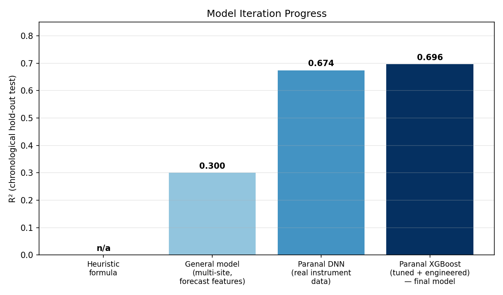
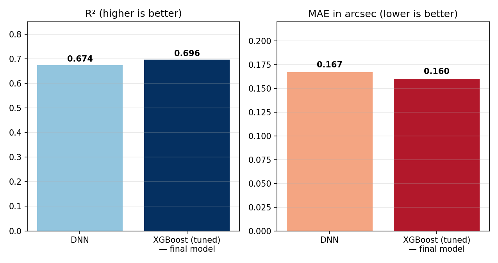
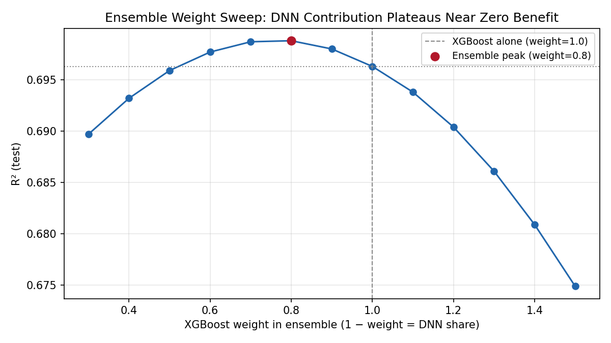
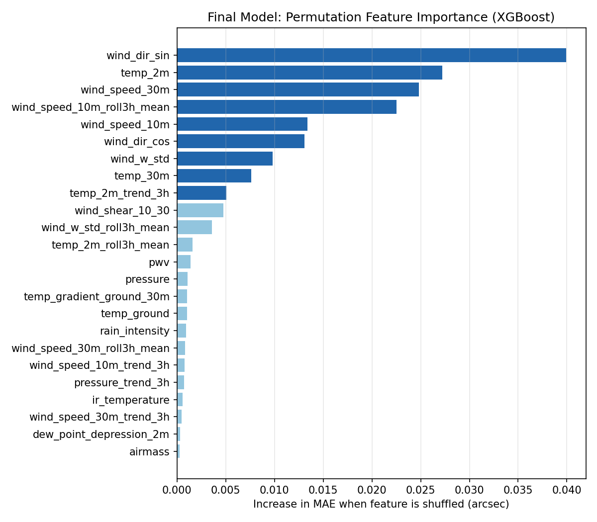

<div dir="rtl">

*[Read this in English \u2192](README.md)*

# پیش‌بینی Seeing نجومی در رصدخانه‌ی Paranal (ESO)

پیش‌بینیِ seeing واقعیِ اندازه‌گیری‌شده توسط ابزار، در سایت Paranal رصدخانه‌ی
جنوبی اروپا (ESO)، با استفاده از داده‌ی واقعیِ چند ابزار پایش وضعیت سایت
(۲۰۱۶ تا ۲۰۲۶) — نه فیچرهای عمومیِ پیش‌بینی آب‌وهوا.

**مدل نهایی: XGBoost، با R² = ۰.۶۹۶ روی یک بازه‌ی ۱.۵ساله‌ی کاملاً آینده و
ندیده (chronological hold-out).**
---

## معرفی

Seeing نجومی میزان تاری تصویر ستاره‌ها ناشی از توربولانس جو رو کمّی می‌کنه و
مستقیماً تفکیک‌پذیریِ واقعیِ قابل‌دستیابیِ یک تلسکوپ زمینی در یک شب مشخص رو
تعیین می‌کنه. این پروژه یک مدل رگرسیونی می‌سازه که seeing رو از روی شرایط
واقعیِ جوی همون سایت پیش‌بینی می‌کنه، با استفاده از داده‌ی تاریخیِ عمومیِ
رصدخانه‌ی Paranal:

| ابزار | اندازه‌گیری | نقش |
|---|---|---|
| DIMM | Seeing (آرک‌ثانیه)، airmass | متغیر هدف |
| LHATPRO (رادیومتر مایکروویو) | دمای مادون‌قرمزِ آسمان، مسیر آب مایع، بخار آب قابل‌بارش | منبع فیچر |
| برج هواشناسی ۳۰ متری | دما، باد (شامل مؤلفه‌ی عمودی)، فشار، بارش | منبع فیچر |

یک ابزار چهارم، MASS (که توربولانس جوّ آزاد رو جدا اندازه می‌گیره)، عمداً
**حذف شد**: چون خروجی‌هاش خودشون اندازه‌گیریِ لحظه‌ایِ توربولانسن که هم‌زمان با
DIMM seeing تولید می‌شن — استفاده ازشون به‌عنوان ورودی، نشتِ اطلاعات از
برچسب حساب می‌شه، نه سیگنال پیش‌بینیِ واقعی.

## نتایج

| مدل | R² (روی test) | MAE (آرک‌ثانیه) | RMSE (آرک‌ثانیه) |
|---|---|---|---|
| رگرسیون خطی / Ridge / چندجمله‌ای | < ۰.۱۰ | — | — |
| Random forest | ~ ۰.۴۵ | — | — |
| شبکه‌ی عصبی عمیق (DNN) | ۰.۶۷۴ | ۰.۱۶۷ | ۰.۲۳۴ |
| **XGBoost (تنظیم‌شده با Optuna + فیچرهای مهندسی‌شده) — مدل نهایی** | **۰.۶۹۶** | **۰.۱۶۰** | **۰.۲۲۵** |

یک ensemble از XGBoost و DNN هم امتحان شد (`src/ensemble_eval.py`) روی یک
بازه‌ی کامل از وزن‌های ترکیب. بهترین ترکیب به R² = ۰.۶۹۸۸ رسید — فقط ۰.۰۰۲۵
بهتر از XGBoost خالص، که در حد نویز این ارزیابیه — و به همین دلیل به‌نفعِ
راه‌حلِ ساده‌ترِ تک‌مدلی استفاده نشد.






## یافته‌های کلیدی

- جهت باد (به‌صورت sin/cos) و دمای نزدیک سطح (۲ متری) قوی‌ترین
  پیش‌بینی‌کننده‌ها هستن.
- میانگین متحرک ۳ساعته‌ی سرعت باد به‌طور محسوسی دقت رو بهتر کرد — یعنی
  **روند** اخیر جو، نه فقط وضعیت لحظه‌ای، سیگنال پیش‌بینی‌کننده داره.
- XGBoost به‌طور پیوسته از یک شبکه‌ی عصبیِ معادل روی این دیتاست جدولی بهتر
  عمل کرد؛ دورهای تکراریِ tuning هایپرپارامتر و مهندسی فیچر، بعد از چند دور
  اول، بازدهیِ نزولی نشون دادن (~۰.۰۰۱ تا ۰.۰۰۳ در هر تکرار) — نشونه‌ی اینکه
  مدل داره به سقف عملیِ این مجموعه فیچر نزدیک می‌شه.
- یک تقسیم **زمانی/بلوکیِ** train/validation/test بدون نشتِ اطلاعات ضروری
  بود: یک split تصادفیِ اولیه، مهارت مدل رو به‌طور گمراه‌کننده‌ای بیشتر از
  واقعیت نشون می‌داد.

## ساختار ریپازیتوری

```
.
├── src/
│   ├── build_dataset.py     # ادغام DIMM + LHATPRO + برج هواشناسی به دیتاست ساعتی
│   ├── train_dnn.py         # baseline شبکه‌ی عصبی با regularization
│   ├── train_xgboost.py     # XGBoost تنظیم‌شده با Optuna (مدل نهایی)
│   └── ensemble_eval.py     # بررسی ensemble (استفاده نشد — به بخش نتایج نگاه کنید)
├── docs/
│   ├── report_EN.docx       # گزارش فنیِ کامل (انگلیسی)
│   └── report_FA.docx       # گزارش فنیِ کامل (فارسی)
├── assets/                  # نمودارهای استفاده‌شده در این README/گزارش
├── requirements.txt
└── LICENSE
```

## داده

داده‌های خامِ ابزارها **در این ریپازیتوری قرار ندارن** (حجم بالا، و طبق
سیاست آرشیو ESO). این داده‌ها برای مقاصد پژوهشی/آموزشی، آزادانه از آرشیو
عمومیِ علمیِ ESO قابل‌دسترسین:

- Seeing از DIMM: `http://archive.eso.org/wdb/wdb/asm/dimm_paranal/form`
- LHATPRO: از همون رابط آرشیوِ شرایط محیطیِ ESO
- برج هواشناسی: `http://archive.eso.org/wdb/wdb/asm/meteo_paranal/form`

بازه‌ی تاریخیِ موردنظر رو برای Paranal دانلود کنید، فایل‌های CSV خروجی
(`seeing.csv`، `lhatpro.csv`، و `meteo_<year>.csv` برای هر سال) رو در ریشه‌ی
پروژه بذارید، بعد این‌ها رو اجرا کنید:

```bash
pip install -r requirements.txt
python src/build_dataset.py      # -> paranal_specific_dataset.csv
python src/train_dnn.py          # -> dnn_model.keras
python src/train_xgboost.py      # -> xgb_model.json (مدل نهایی)
python src/ensemble_eval.py       # اختیاری: بازتولید مقایسه‌ی ensemble
```

فایل‌های برج هواشناسی به‌صورت سالانه جدا شدن چون فرم query ESO روی
درخواست‌های چندساله با دقت یک‌دقیقه‌ای timeout می‌کنه؛ `build_dataset.py` یک
لیست از فایل‌های سالانه رو قبول می‌کنه.

## محدودیت‌ها و کارهای آینده

- **در دسترس‌بودنِ پیش‌بینی**: چند تا از قوی‌ترین فیچرها کاملاً به ابزارهای
  اختصاصیِ Paranal وابسته‌ان و هیچ مدل عمومیِ پیش‌بینیِ آب‌وهوایی تولیدشون
  نمی‌کنه؛ حتی خودِ آرشیو ambient دیتای Paranal فقط یک‌بار در هر شبِ محلی
  آپدیت می‌شه، نه لحظه‌ای. به همین دلیل، این مدل در حالت فعلی برای تحلیل
  گذشته‌نگر/آماری مناسب‌تره، نه یک محصولِ پیش‌بینیِ زنده.
- **عمق تاریخی**: آرشیو DIMM استفاده‌شده از آوریل ۲۰۱۶ شروع می‌شه؛ نسل
  قدیمی‌ترِ DIMM در ESO تا ۱۹۹۸ داده داره.
- **تعمیم به سایت‌های دیگه**: این مدل عمداً اختصاصیِ Paranal‌ه. گسترش این
  روش‌شناسی به رصدخانه‌های دیگه نیازمند یک دیتاست چندابزاریِ معادل برای هر
  سایته — از همکاری استقبال می‌کنم (به بخش تماس نگاه کنید).

## تماس / همکاری

من به گسترشِ این روش‌شناسی برای رصدخانه‌های دیگه با ابزار پایشِ معادل علاقه‌مندم.
اگه رصدخانه‌ی شما می‌تونه داده‌ی تاریخیِ سنسور seeing و هواشناسیِ محلی رو به
اشتراک بذاره، از فرصت همکاری روی یک مدل اختصاصی استقبال می‌کنم. تماس:
**mohamadkarimi.dev@gmail.com**.

</div>
